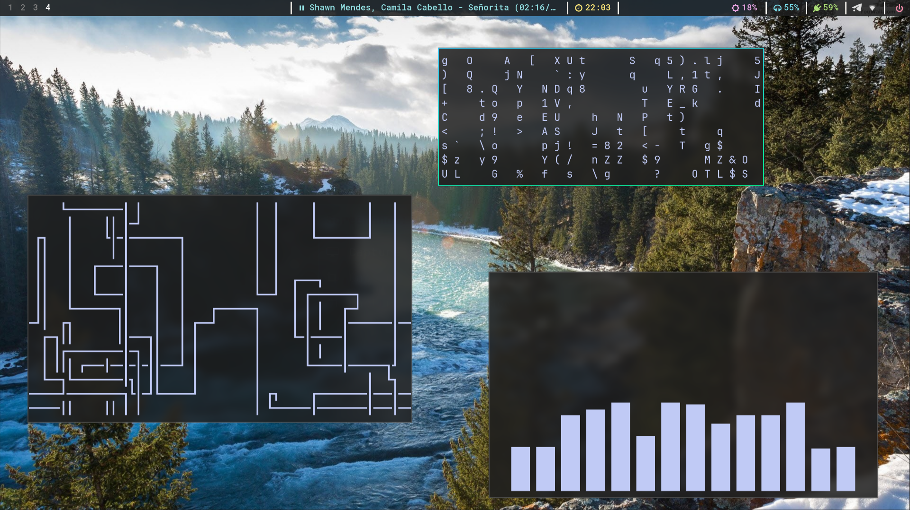
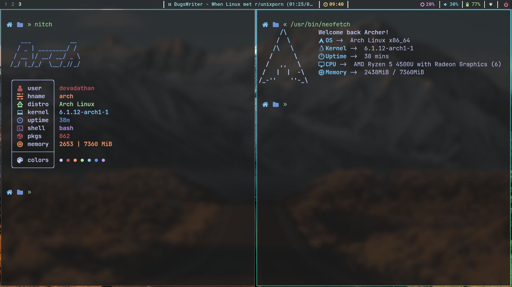

# My dotfiles 🖤

My minimal `hyprland` config which I daily drive.

These dotfiles are managed using [Dotbot](https://github.com/anishathalye/dotbot)

## Previews



<br>



<br>

---

## Stuff I use

- [Hyprland](https://hyprland.org/) - An awesome wl-roots based wayland compositor
- [Waybar](https://github.com/Alexays/Waybar) - Bar for wl-roots based wayland compositors
- [Kitty](https://sw.kovidgoyal.net/kitty/) - Terminal emulator
- [Zsh](https://www.zsh.org/) - Shell
- [Zap Zsh](https://github.com/zap-zsh/zap) - Zsh plugin manager
- [Starship](https://starship.rs/) - Shell prompt
- [Tmux](https://github.com/tmux/tmux) - Terminal multiplexer
- [Lbonn rofi](https://github.com/lbonn/rofi) - A fork of Rofi for wayland
- [Sway bg](https://github.com/swaywm/swaybg) - Wallpaper tool
- [Sway lock effects](https://github.com/mortie/swaylock-effects) - Lock screen
- [Wlogout](https://github.com/ArtsyMacaw/wlogout) - Logout menu
- [Vimiv](https://github.com/karlch/vimiv) - Image viewer
- [Mpv](https://github.com/mpv-player/mpv) - Video player
- [Dunst](https://github.com/dunst-project/dunst) - A light weight notification daemon
- [Zathura](https://github.com/pwmt/zathura) - Document viewer
- [Ranger](https://github.com/ranger/ranger) - TUI filemanager
- [Thunar](https://github.com/xfce-mirror/thunar) - GUI filemanager
- [Neovim](https://github.com/neovim/neovim) - Text editor

## Quick setup:

_These dotfiles are configured to work on my system, these may or may not work the same out of the box on your system. So make needed the changes._
<br>

1. Clone the repo:

```bash
git clone https://github.com/devadathanmb/dotfiles
```

2. Setup the symlinks:

```bash
cd dotfiles/
./install
```

---

_Find my neovim configs [here](https://github.com/devadathanmb/entevim)_
